# Five Dollar Club (FDC) Presentation
## Decentralized Income Platform on BSC Mainnet
### fivedollar.bnb

---

## 📊 4 Income Streams Overview

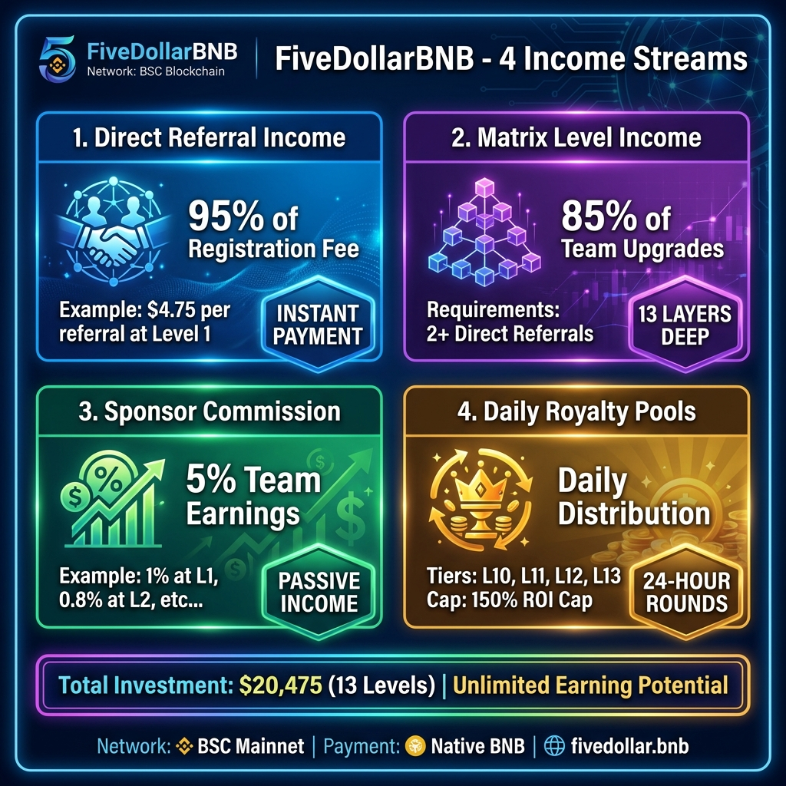

**Four Ways to Earn:**
1. **Direct Referral Income** - 95% instant payment
2. **Matrix Level Income** - 85% from team upgrades  
3. **Sponsor Commission** - 5% passive earnings
4. **Daily Royalty Pools** - 24-hour distributions

**Total Investment:** $20,475 (13 Levels)  
**Network:** BSC Mainnet | **Payment:** Native BNB

---

## 💰 Earning Potential Breakdown

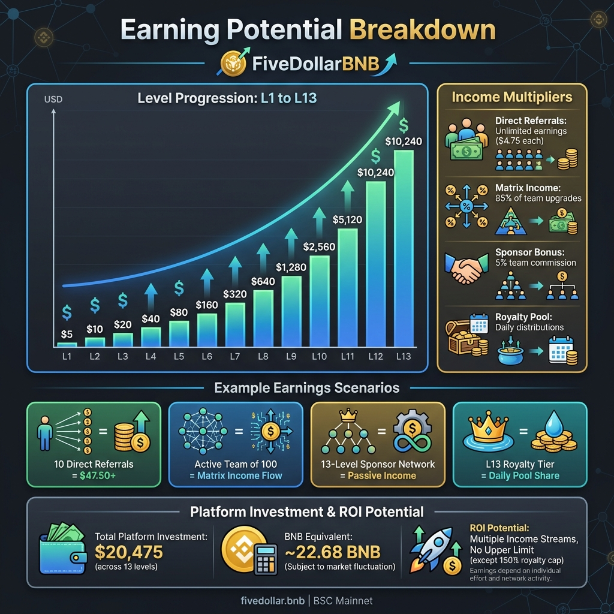

**Platform Investment & ROI Potential**

- **Level Progression:** L1 ($5) to L13 ($10,240)
- **Total Investment:** $20,475 across 13 levels
- **BNB Equivalent:** ~22.68 BNB
- **Income Sources:** Multiple streams, no upper limit (except 150% royalty cap)

**Example Scenarios:**
- 10 Direct Referrals = $47.50+
- Active Team of 100 = Matrix Income Flow
- 13-Level Sponsor Network = Passive Income
- L13 Royalty Tier = Daily Pool Share

---

## 🤝 Income Stream #1: Direct Referral Income

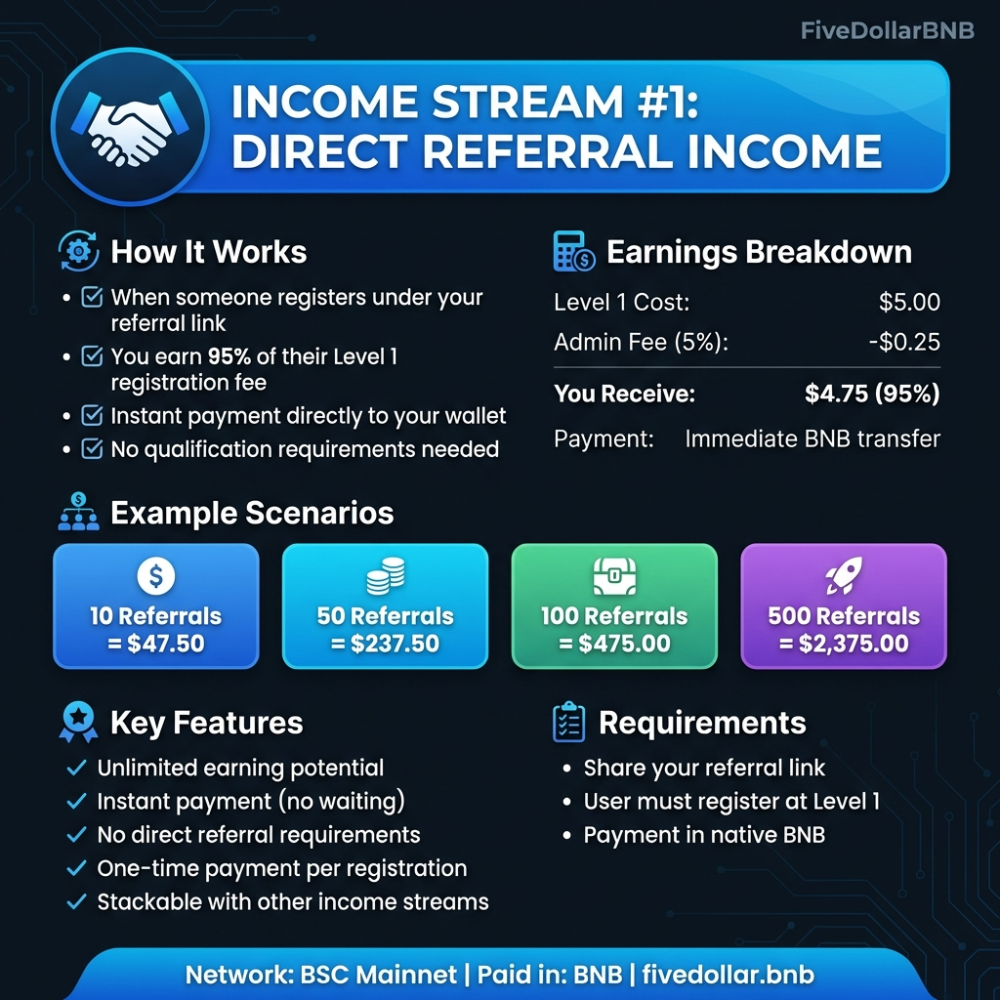

**How It Works:**
- Earn 95% of Level 1 registration fee
- Instant BNB payment to your wallet
- No qualification requirements

**Earnings:**
- Level 1 Cost: $5.00
- You Receive: $4.75 (95%)
- Payment: Immediate

**Earning Examples:**
- 10 Referrals = $47.50
- 50 Referrals = $237.50
- 100 Referrals = $475.00
- 500 Referrals = $2,375.00

---

## 🔷 Income Stream #2: Matrix Level Income

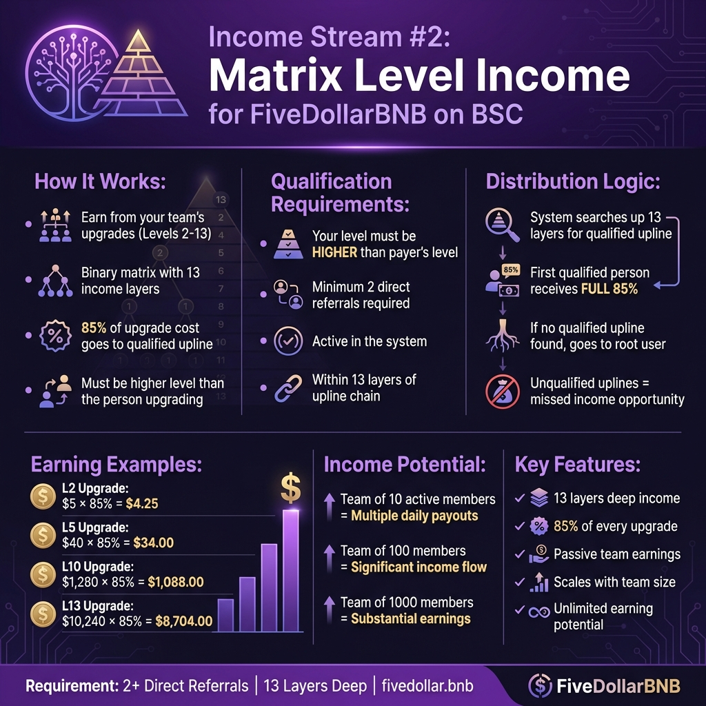

**How It Works:**
- 85% of upgrade cost → First qualified upline
- 13 layers deep income potential
- Binary matrix placement

**Qualification:**
- Your level > Payer's level
- Have 2+ direct referrals
- Within 13 layers

**Earnings by Level:**
- L2: $4.25 | L5: $34.00
- L10: $1,088.00 | L13: $8,704.00

---

## 💚 Income Stream #3: Sponsor Commission

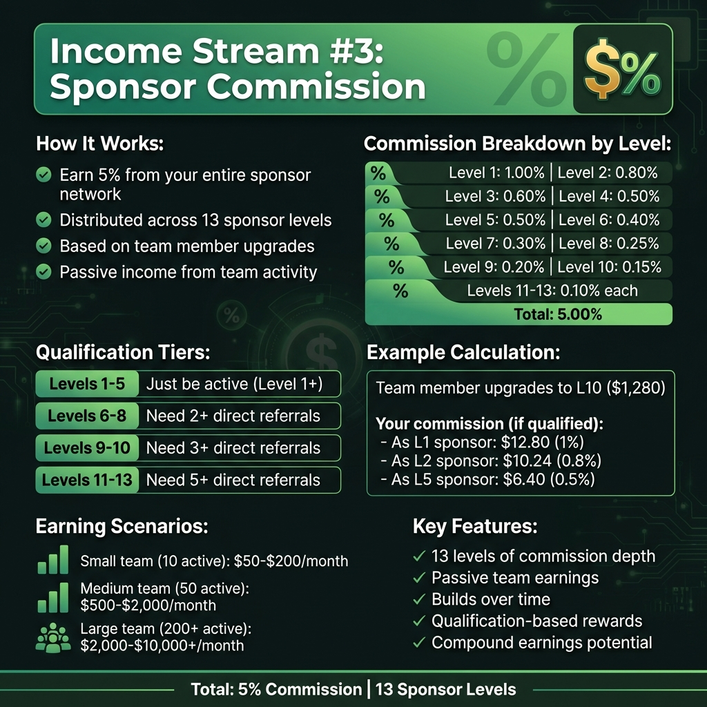

**Commission Structure:**
- Total: 5% across 13 sponsor levels
- L1: 1.00% | L2: 0.80% | L3: 0.60%
- Qualification tiers based on direct referrals

**Monthly Income Potential:**
- Small team (10 active): $50-$200/month
- Medium team (50 active): $500-$2,000/month
- Large team (200+ active): $2,000-$10,000+/month

---

## 🏆 Income Stream #4: Daily Royalty Pools

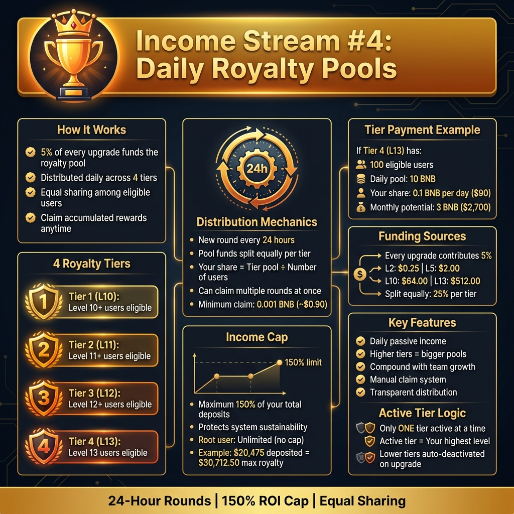

**4 Royalty Tiers:**
- Tier 1 (L10): Level 10+ eligible
- Tier 2 (L11): Level 11+ eligible
- Tier 3 (L12): Level 12+ eligible
- Tier 4 (L13): Level 13 users only

**Distribution:**
- 5% of every upgrade → Royalty Pool
- Daily 24-hour rounds
- Equal sharing among eligible users
- 150% ROI cap (sustainability)

---

## 🎯 Why Join Five Dollar Club?

**Decentralized & Transparent**
- Smart contract on BSC Mainnet
- Fully verified code
- Your funds, your control

**Low Entry Barrier**
- Start with just $5
- Progressive upgrade system
- No minimum team requirement

**Global Opportunity**
- Borderless participation
- Native BNB payments (no KYC)
- 24/7 automated operations

---

## ⚡ Features & Benefits

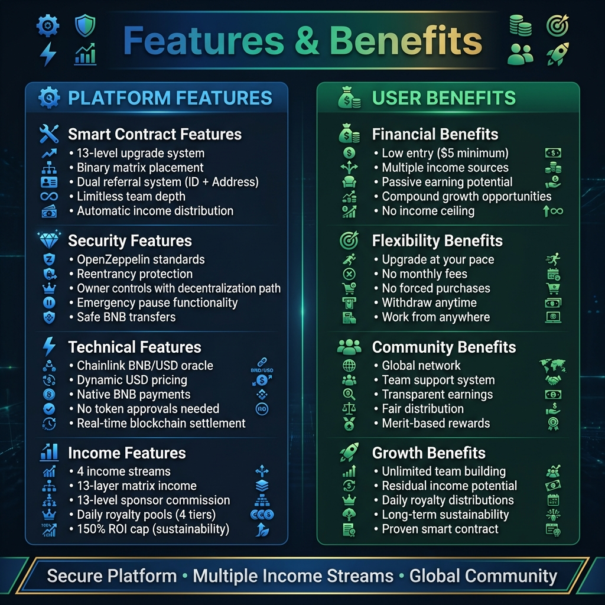

**Platform Features:**
- 13-level upgrade system
- OpenZeppelin security
- Chainlink oracle integration
- 4 income streams

**User Benefits:**
- Low entry ($5 minimum)
- Multiple income sources
- Upgrade at your pace
- Global network

---

## 📝 How to Join & Upgrade

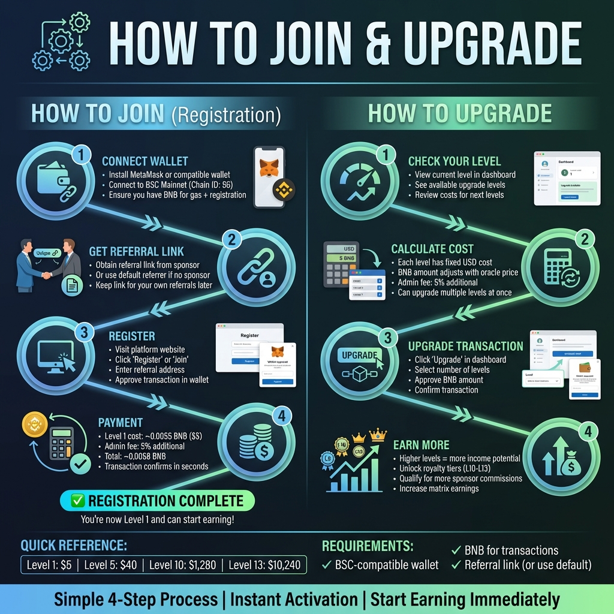

**Registration (4 Steps):**
1. Connect wallet (MetaMask, BSC Mainnet)
2. Get referral link
3. Register on platform
4. Pay ~0.0058 BNB

**Upgrade Process:**
1. Check your current level
2. Calculate upgrade cost
3. Approve transaction
4. Earn more income

---

## 💵 Complete Level Costs Breakdown

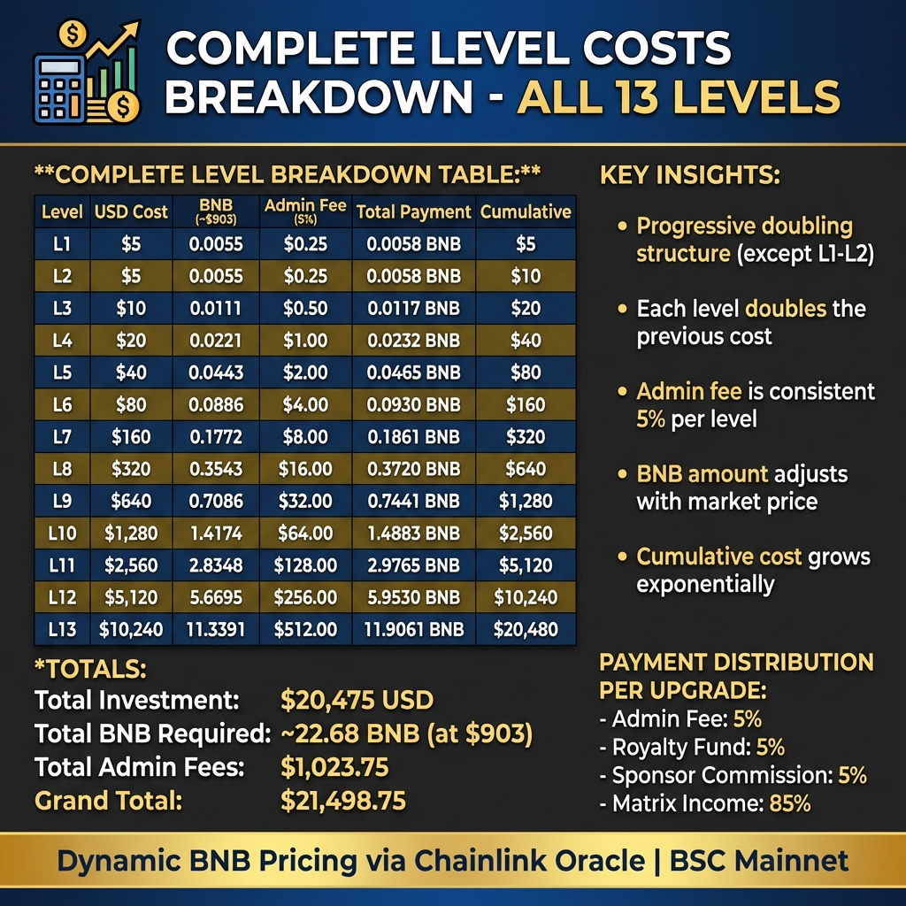

**All 13 Levels:**

| Level | Cost | BNB | Cumulative |
|-------|------|-----|------------|
| L1 | $5 | 0.0055 | $5 |
| L2 | $5 | 0.0055 | $10 |
| L3 | $10 | 0.0111 | $20 |
| ... | ... | ... | ... |
| L13 | $10,240 | 11.3391 | $20,480 |

**Total Investment:** $20,475  
**Total BNB:** ~22.68 BNB

---

## 👥 Team Building & Earning Scenarios

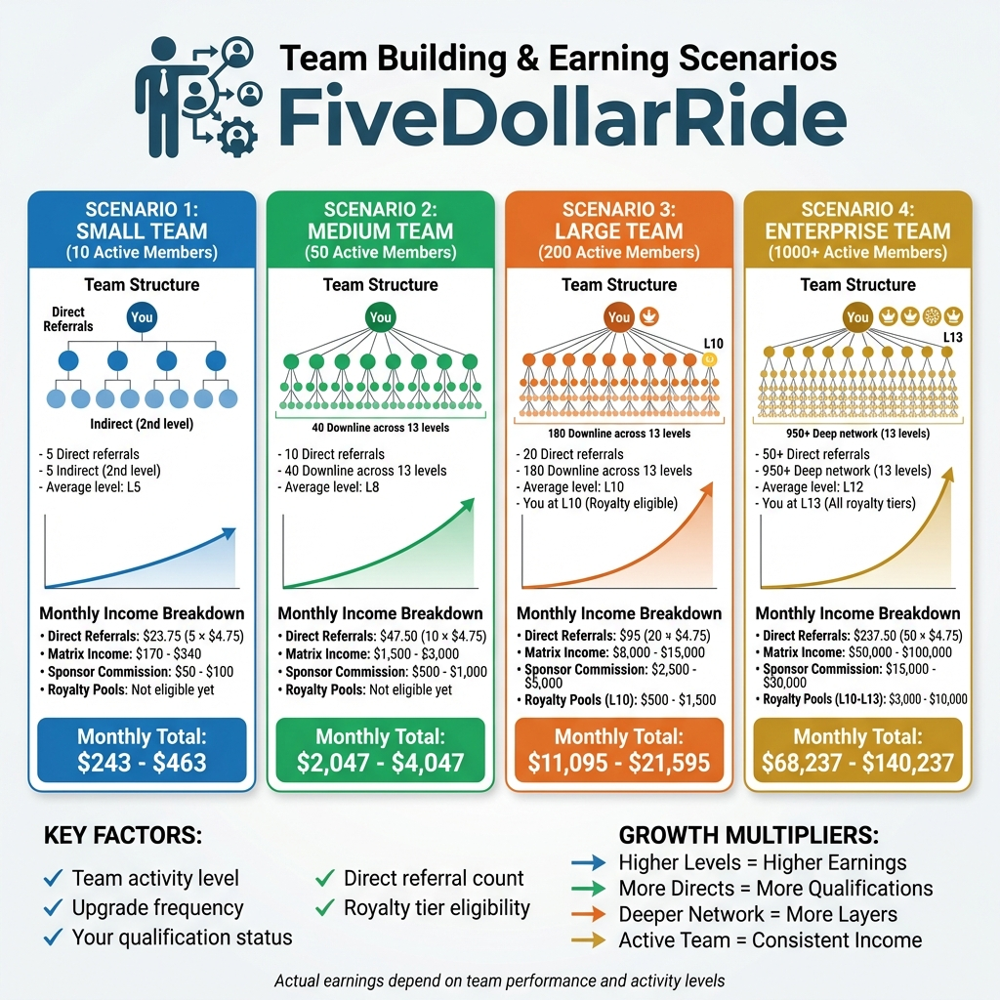

**4 Growth Scenarios:**

**Small Team (10 members):** $243-$463/month  
**Medium Team (50 members):** $2,047-$4,047/month  
**Large Team (200 members):** $11,095-$21,595/month  
**Enterprise (1000+ members):** $68,237-$140,237/month

---

## 🔷 Matrix Income Calculator

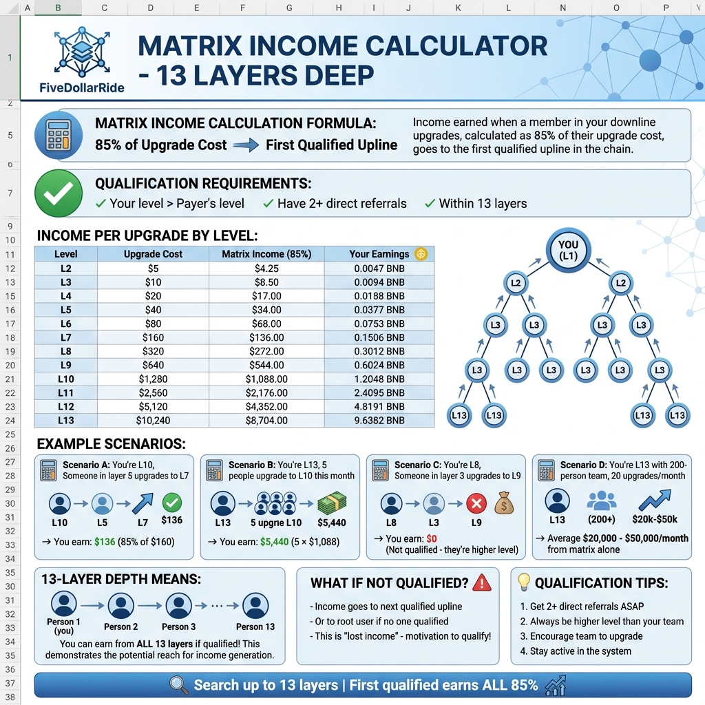

**Income Per Upgrade:**
- 85% goes to first qualified upline
- Search up to 13 layers
- Must be higher level than payer

**Example:**
- You're L13, 5 people upgrade to L10
- You earn: $5,440 (5 × $1,088)

---

## 💚 Sponsor Commission Calculator

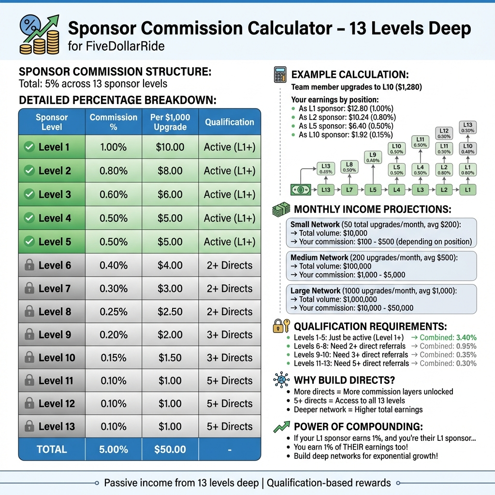

**13 Sponsor Levels:**
- Total: 5% commission
- L1: 1.00% down to L13: 0.10%

**Monthly Projections:**
- 50 upgrades ($10,000 volume): $100-$500
- 200 upgrades ($100,000 volume): $1,000-$5,000
- 1000 upgrades ($1M volume): $10,000-$50,000

---

## 🏆 Daily Royalty Pool Calculator

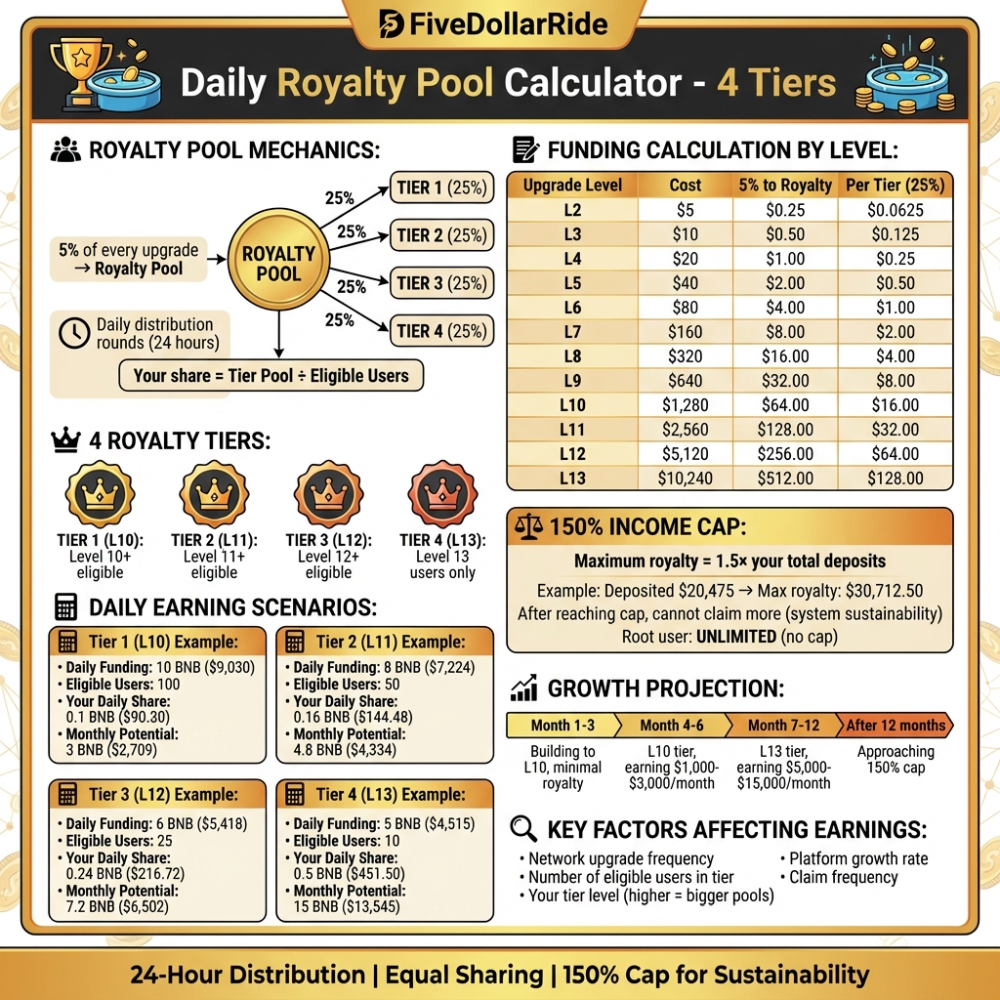

**4 Tiers - Daily Distribution:**

**Tier 1 (L10):** 0.1 BNB/day ($90) → 3 BNB/month  
**Tier 2 (L11):** 0.16 BNB/day ($144) → 4.8 BNB/month  
**Tier 3 (L12):** 0.24 BNB/day ($216) → 7.2 BNB/month  
**Tier 4 (L13):** 0.5 BNB/day ($451) → 15 BNB/month

**150% Income Cap:** Max 1.5× your deposits

---

## 📊 Complete ROI Projection

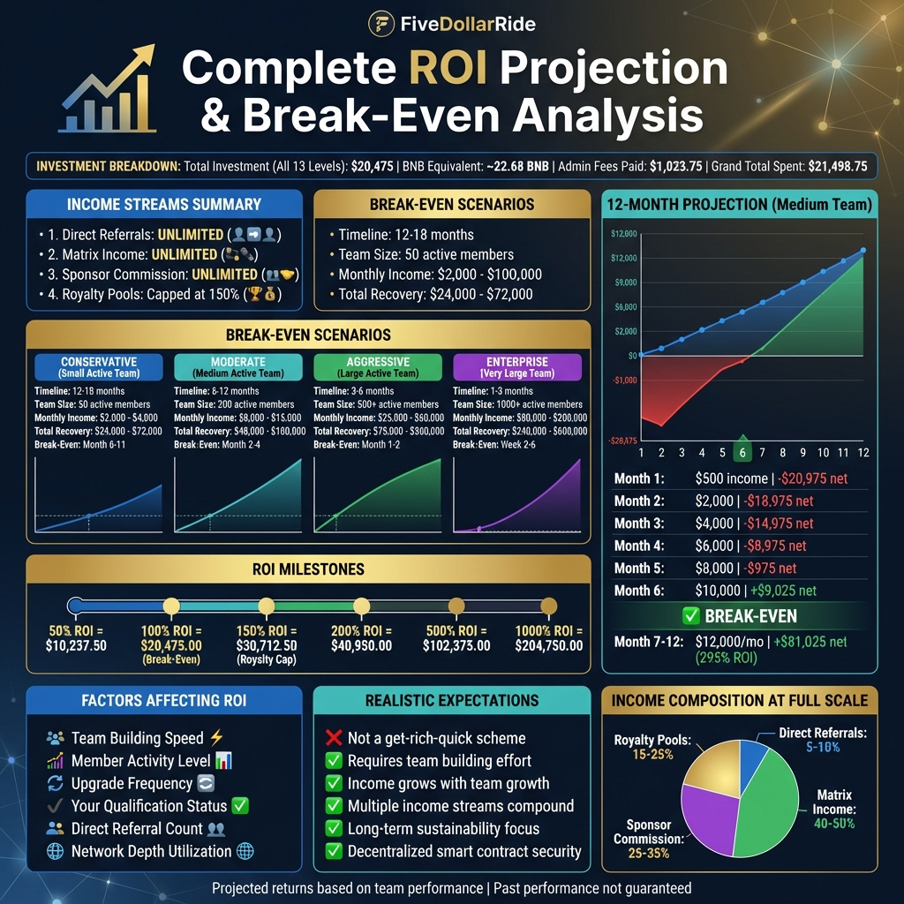

**Break-Even Scenarios:**

**Conservative (50 members):** 6-11 months  
**Moderate (200 members):** 2-4 months  
**Aggressive (500+ members):** 1-2 months  
**Enterprise (1000+ members):** 2-6 weeks

**ROI Milestones:**
- 100% ROI = $20,475 (break-even)
- 150% ROI = $30,712.50 (royalty cap)
- 500% ROI = $102,375
- 1000% ROI = $204,750

---

## 🎯 Vision & Mission

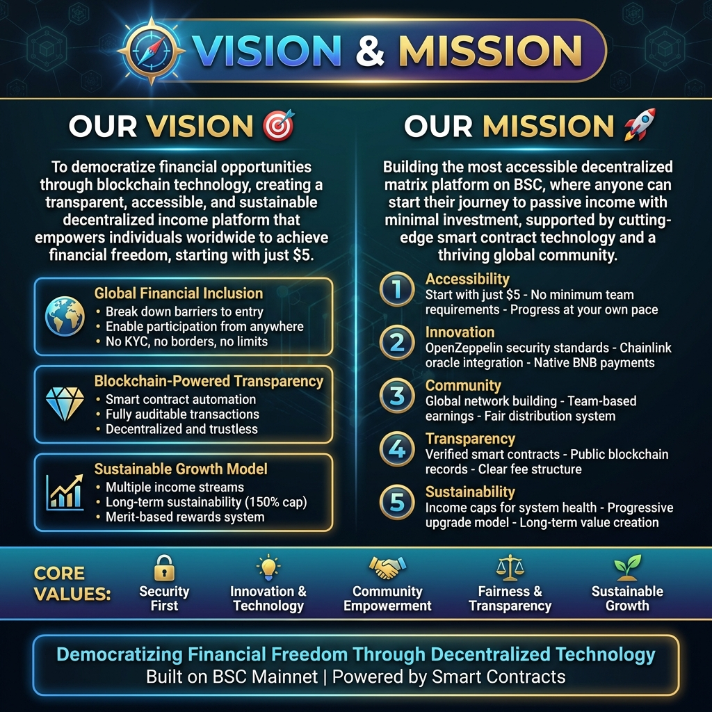

**Our Vision:**
Democratizing financial opportunities through blockchain technology, creating a transparent, accessible, and sustainable platform starting with just $5.

**Our Mission:**
Building the most accessible decentralized matrix platform on BSC with cutting-edge smart contract technology.

**Core Values:**
- Security First
- Innovation & Technology
- Community Empowerment
- Fairness & Transparency
- Sustainable Growth

---

## ⚠️ Important Disclaimers

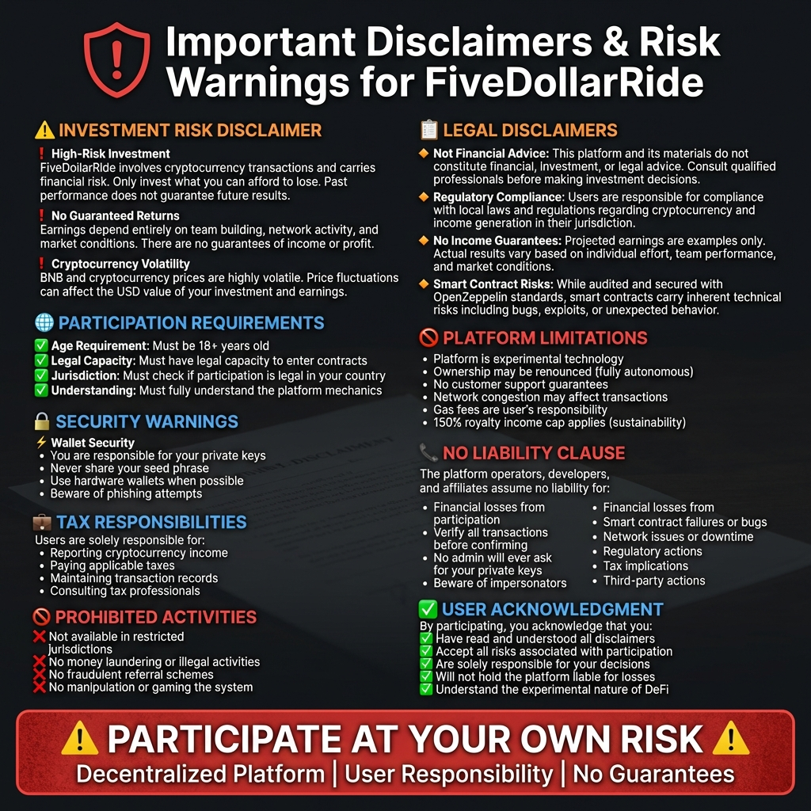

**Risk Warnings:**
- High-risk cryptocurrency investment
- No guaranteed returns
- BNB price volatility
- Only invest what you can afford to lose

**Legal:**
- Not financial advice
- Users responsible for regulatory compliance
- Must be 18+ years old
- Smart contract risks apply

**⚠️ PARTICIPATE AT YOUR OWN RISK ⚠️**

---

## 🚀 Get Started Today

**Network:** BSC Mainnet (Chain ID: 56)  
**Domain:** fivedollar.bnb  
**Payment:** Native BNB  
**Start:** Just $5

**Contract Features:**
✅ OpenZeppelin Security  
✅ Chainlink Oracle  
✅ Verified on BSCScan  
✅ Reentrancy Protection

**Join the decentralized financial revolution!**

---

## 📞 Additional Information

**Platform:** Five Dollar Club (FDC)  
**Network:** BSC Mainnet  
**Technology:** Solidity 0.8.28, OpenZeppelin v5, Chainlink  
**Levels:** 13 ($5 to $10,240)  
**Income Streams:** 4 (Direct, Matrix, Sponsor, Royalty)

**Documentation:**
- Smart Contract: Verified on BSCScan
- Technical Docs: Available in repository
- Support: Community-driven

---

**Thank you for your interest in Five Dollar Club!**

*Decentralized • Transparent • Accessible*  
**fivedollar.bnb | BSC Mainnet**
